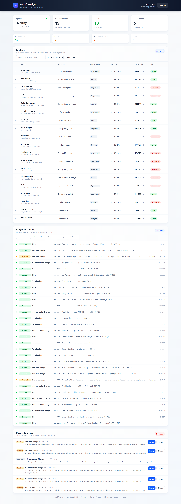
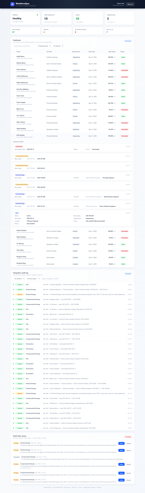
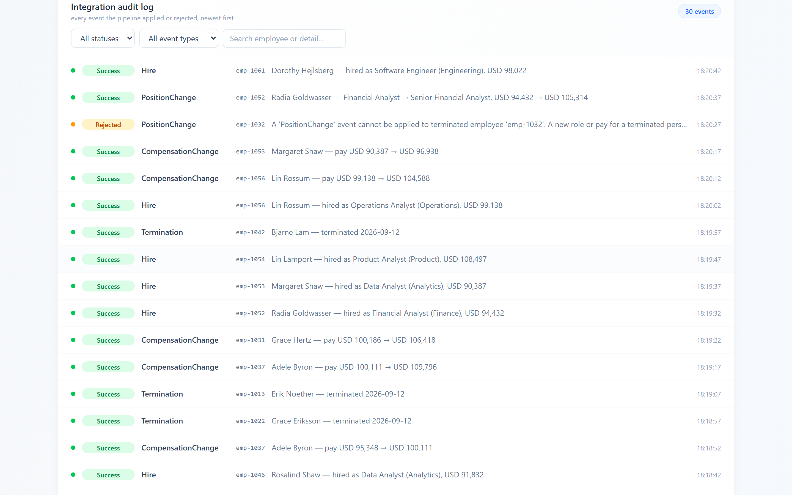
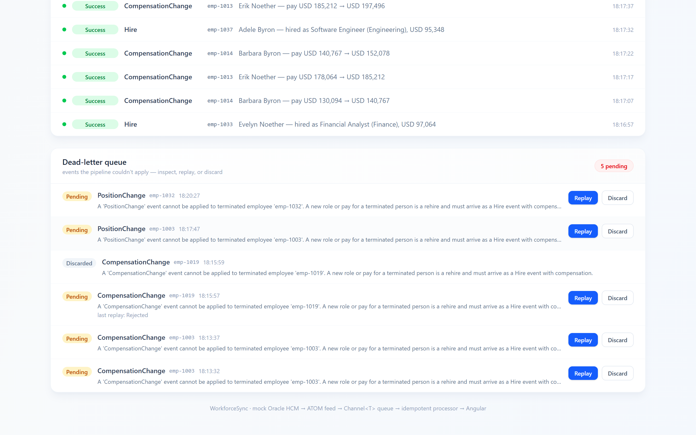

# WorkforceSync

An end-to-end **HR data integration platform** — a working demonstration of the
integration patterns used in enterprise HR technology (Oracle HCM Cloud ↔ enterprise
systems): ATOM feed ingestion, data transformation & validation, message queuing with
backpressure, idempotent processing, a dead-letter queue with replay, JWT-secured REST
APIs, and a live Angular dashboard.

Built with C# and Angular to work through the integration patterns I use in production
— ATOM feeds, OAuth/JWT, message queuing, and middleware — end to end.

[](https://github.com/YOUR_GITHUB_USERNAME/workforcesync/actions/workflows/ci.yml)


## Demo

A ~50-second walkthrough: sign in, watch the live feed land events, drill into an
employee's change history, see the pipeline reject a bad one, and replay it from the
dead-letter queue.

<video src="docs/WorkforceSync-Demo.mp4" controls width="100%"></video>

<p align="center">
  
</p>

## What it does

A mock **Oracle HCM Cloud** publishes an ATOM feed of workforce events — hires,
promotions, comp changes, terminations. A .NET service polls the feed, transforms and
validates each payload, queues it through a bounded `Channel<T>`, and applies it
idempotently. A JWT-secured REST API exposes the data, and an Angular dashboard shows
it live.

The feed is *not* a fixed script — it's a weighted-random stream that keeps evolving
(people get promoted, paid more, leave, and new people join), so the pipeline is
exercised against a realistic, unbounded workload. It also occasionally emits a
**stale event** (a comp or role change for someone who already left), which the
processor correctly **rejects** — exactly the kind of late/duplicated message real
feeds produce.

### The dashboard

- **Pipeline metrics** — events applied, rejected, dead-letter pending, and throughput
  (events/min), refreshed live.
- **Live KPIs** — pipeline health, headcount, active/terminated, departments.
- **Employee table** — auto-refreshes as the feed publishes; search + per-column
  filters (department, status); click any row for its **change history**.
- **Change history** — a per-employee audit trail showing each field's old → new value
  (hire → promotion → comp), so you can see *how* a record evolved.
- **Integration audit log** — every event the pipeline applied *or rejected*, with
  status, type, and a human-readable description.
- **Dead-letter queue** — events the pipeline couldn't apply, with the reason, and
  one-click **Replay** or **Discard**.

<p align="center">
  
</p>

<p align="center">
  
</p>

<p align="center">
  
</p>

## The deliberate design choices

This isn't a CRUD app — the interesting part is how the pipeline behaves under
real-world mess. Three choices are made on purpose:

- **Idempotency.** Every event carries a stable `EventId`. The processor records it in
  a `ProcessedEvent` table before applying, so a redelivered or duplicated feed entry
  is a no-op, not a double-apply. This is the single most important property of any
  feed integration — a retry must be safe.
- **Backpressure.** Events flow through a bounded `Channel<T>` (capacity 1000). If the
  consumer falls behind, the producer blocks rather than buffering unboundedly into
  memory — the pipeline degrades gracefully instead of OOM-ing.
- **Failure isolation.** A bad event (a role change for a terminated person) is caught,
  recorded as **Rejected** in the audit log, and parked in the **dead-letter queue** —
  it never poisons the rest of the stream. You can inspect the reason and **replay**
  it once the underlying data is fixed, or discard it.

## Architecture

```
┌─────────────────┐   ATOM feed    ┌──────────────────────────────┐
│  HcmSource      │ ─────────────► │  WorkforceSync.Api           │
│  (mock Oracle   │  hire/term/    │  ┌────────────────────────┐  │
│   HCM Cloud)    │  position/comp │  │ Background poller      │  │
└─────────────────┘   events       │  └───────────┬────────────┘  │
                                   │              ▼               │
                                   │  ┌────────────────────────┐  │
                                   │  │ Bounded Channel<T>     │  │
                                   │  │ (backpressure)         │  │
                                   │  └───────────┬────────────┘  │
                                   │              ▼               │
                                   │  ┌────────────────────────┐  │
                                   │  │ Transform + validate   │  │
                                   │  │ (Core)                 │  │
                                   │  └───────────┬────────────┘  │
                                   │              ▼               │
                                   │  ┌────────────────────────┐  │
                                   │  │ Idempotent processor   │  │
                                   │  │ + dead-letter queue    │  │
                                   │  └───────────┬────────────┘  │
                                   │              ▼               │
                                   │  ┌────────────────────────┐  │
                                   │  │ EF Core + SQLite       │  │
                                   │  └───────────┬────────────┘  │
                                   │              │               │
                                   │  JWT auth (access + refresh) │
                                   └──────────────┬───────────────┘
                                                  │ REST + OpenAPI
                                                  ▼
                                   ┌──────────────────────────────┐
                                   │  Angular 20 dashboard        │
                                   │  (signals, guards,           │
                                   │   interceptors, Tailwind)    │
                                   └──────────────────────────────┘
```

## Projects

| Project | Purpose |
|---|---|
| `WorkforceSync.Core` | Domain models, ATOM→entity transformation, validation. Framework-agnostic, heavily unit-tested. |
| `WorkforceSync.Api` | ASP.NET Core Web API: JWT auth, workforce endpoints, background ingestion, `Channel<T>` queue, idempotent processor, dead-letter queue, EF Core + SQLite, OpenAPI. |
| `WorkforceSync.HcmSource` | Mock Oracle HCM Cloud: emits an ATOM feed of hire/terminate/position/comp events. |
| `WorkforceSync.Core.Tests` | xUnit unit + integration tests for Core (and API via WebApplicationFactory). |
| `frontend/` | Angular 20 dashboard (standalone, signals, Tailwind). |

## Quick start

**Option A — Docker (one command):**

```bash
docker compose up --build
# App: http://localhost:8080
```

**Option B — run locally:**

```bash
# Backend
dotnet run --project WorkforceSync.Api
# API: http://localhost:5140  (Swagger: /swagger)

# Frontend
cd frontend && npm install && npm start
# App: http://localhost:4200
```

Sign in with the demo account (`demo@corp.example` / `Demo123!`) — it's pre-filled on
the login screen. The mock HCM publishes a new workforce event every few seconds; watch
the dashboard update live.

## Tests

```bash
dotnet test          # C# unit + integration tests (28 passing)
cd frontend && npm test   # Angular (Karma/Jasmine)
```

## Conventions

See `AGENTS.md` for the code conventions used across the repo.
